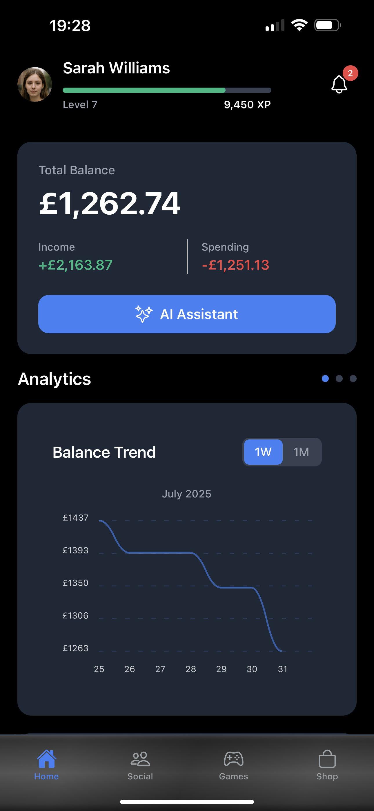
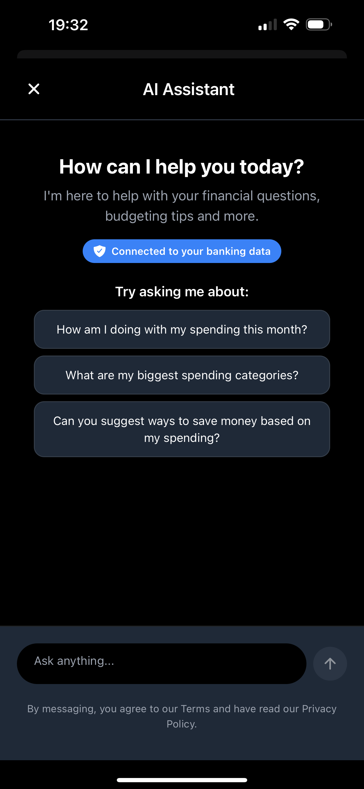
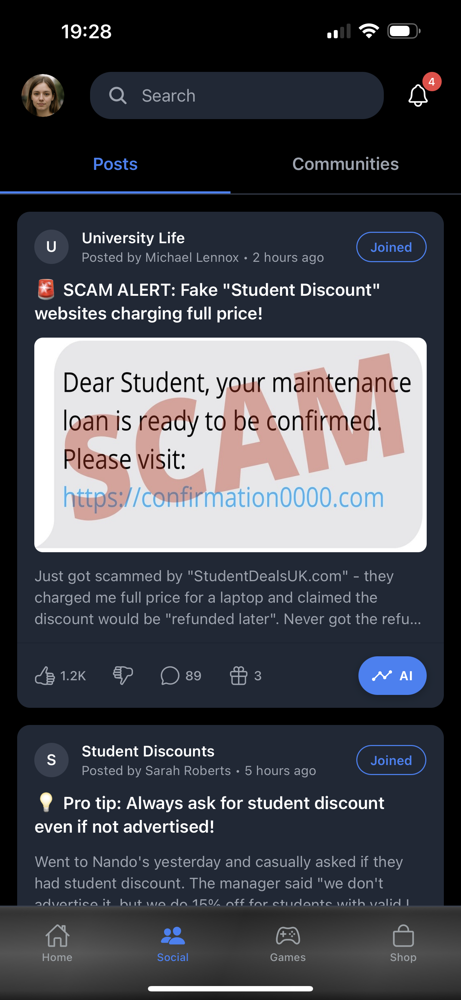
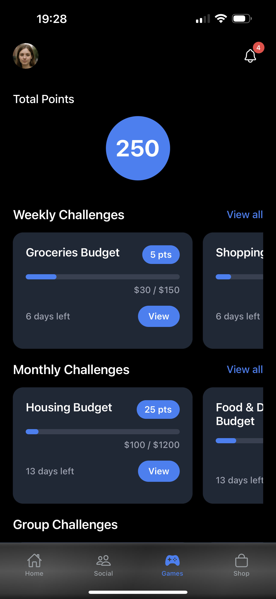
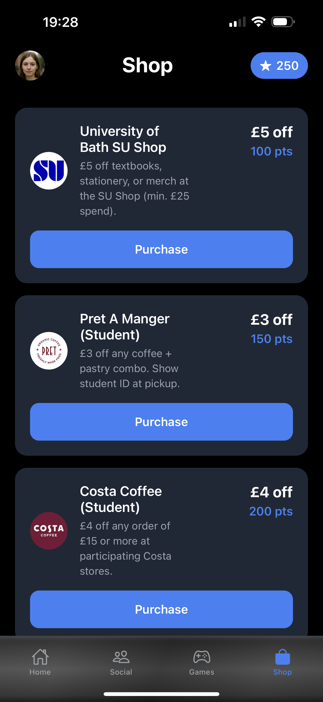

# Work in Fintech AI Summit Hackathon Project - VaultMate 

At the WIF AI Summit, we were tasked with building an AI-powered fintech app that addresses one of three given real-world challenges. For our project, we focused on the **Gamified Personal Finance Assistant** challenge track. After a week of collaboration and building, we came up with VaultMate - a secure, social finance tracking app for university students that helps build and nurture their knowledge when encountering common financial scams.

## The Problem:
Over a **third** of students in the UK have been targeted by fraud, scams and phishing, according to [NatWest’s 2023 Student Living Index](https://www.natwestgroup.com/news-and-insights/news-room/press-releases/financial-capability-and-learning/2023/aug/one-in-three-students-targeted-by-fraudsters.html). This statistic alone highlights the constant threat university students face from phishing and other type of scams in the UK. We need to better inform and educate stuents in order to avoid these financial scams in the future.

## Core features:
- An AI assistant that provides comprehensive review and guidance on the user's financial behaviour
- A social media tab for university students to post about student discounts and scam encounters, potentially helping build a community of trust for students to inform others of potential scams within the area
- A games tab that allows users to complete weekly and monthly challenges, as well as custom group challenges for students to complete together, encouraging social accountability to build towards better spending habits
- An in-app points system that allows users to buy discounts from local shops, encouraging future enngagement with the app

**Note**: This project is more so a proof-of-concept than a MVP, with only the points system, games and AI features being fully implemented.

## Preview:


## Installation:
1. Clone the repository:  
```bash
git clone <https://github.com/AI-I224/wif-mobile-app>
cd wif-mobile-app
```

2. Install dependencies:
```bash
npm install
```

3. Start development build:
```bash
npx expo start
```
